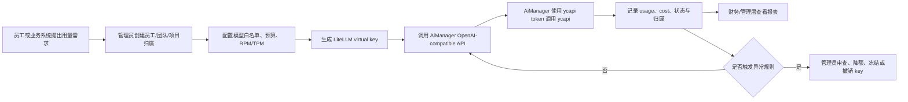
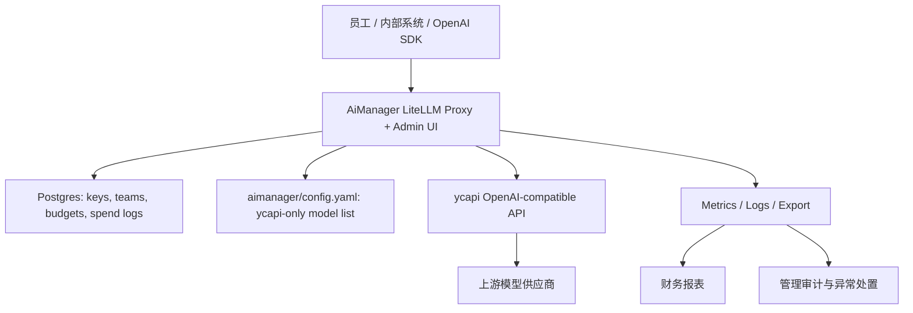

# AiManager 需求文档 v2

日期：2026-06-29

## 1. 背景与目标

公司采购的大模型 API 需要统一管理，既要方便员工和内部系统使用，也要控制成本、降低私用和滥用风险、满足审计追溯要求。AiManager 基于 LiteLLM，保留其 key、team、budget、usage、admin UI 等管理能力，并将所有已配置的上游模型调用统一收敛到 ycapi。

本项目不承诺用 API 网关自动判断每一次请求是否“绝对属于工作”。v1 的目标是建立可执行的治理闭环：员工实名使用、用途和成本中心可追踪、权限和预算可限制、异常使用可发现、违规 key 可停用、财务和管理层可复盘。

## 2. 参与角色与核心诉求

| 角色 Agent | 核心诉求 | 对 PRD 的关键约束 |
| --- | --- | --- |
| 公司总经理 | 投入产出可衡量，降低浪费和合规风险 | 必须有成本、使用率、异常处置和管理看板 |
| 开发人员 | 接入简单、兼容 OpenAI SDK、环境稳定 | 保持 OpenAI-compatible API，不强迫业务系统大改 |
| 市场人员 | 能安全用于文案、资料、活动和客户沟通 | 要有场景标签、品牌/合规提醒、可追踪的团队额度 |
| 财务人员 | 成本归集、预算控制、对账清晰 | 必须按部门、项目、员工、模型维度出账和预警 |
| 架构师 | 上游边界清晰、可扩展、可观测、可恢复 | 所有上游只走 ycapi，网关、DB、日志、告警边界明确 |
| UI/UED | 管理流程清楚，低学习成本，异常状态可理解 | 关键页面需覆盖 happy path、空状态、错误状态、权限受限状态 |

## 3. MVP 边界

### 3.1 P0 必须完成

1. **统一 API 入口**：内部应用和员工只使用 AiManager 分发的 base URL 与 virtual key；AiManager 上游只调用 ycapi。
2. **实名与组织归属**：每个 key 绑定员工、部门、项目或业务场景，不允许共享通用 key 作为日常使用入口。
3. **用途声明与场景标签**：key 申请时必须选择工作场景，调用侧必须能通过 metadata 或 key 归属回溯用途。
4. **模型白名单**：v1 只开放 `gemini-2.5-flash`、`deepseek-chat`、`ycapi-image-1`；`ycapi-video-1` 暂缓。
5. **预算与限流**：支持按员工、团队、项目配置月预算、RPM/TPM、模型访问范围。
6. **使用审计**：记录调用时间、调用方、key、模型、token/费用、状态码、错误原因、请求来源标识；默认不保存完整 prompt 正文。
7. **异常发现与处置**：支持超预算、非工作时间激增、异常失败率、个人 key 共享迹象等基础规则；管理员可冻结或撤销 key。
8. **财务报表**：按部门、项目、模型、员工、日期维度汇总用量和费用，支持导出。
9. **管理入口**：保留 LiteLLM Admin UI，作为 v1 管理控制台；后续可封装更贴近业务角色的管理页面。

### 3.2 P1 后续增强

1. 企业微信审批和通知：key 申请、额度调整、异常告警进入 WeCom。
2. DLP 与敏感信息检测：对 prompt/response 做脱敏采样或拦截策略。
3. 工作用途智能判别：基于场景、时间、内容特征做风险评分，而不是直接阻断全部可疑请求。
4. ycapi video adapter：以明确的异步创建和轮询语义接入 `ycapi-video-1`。
5. 自研业务管理 UI：面向总经理、财务、部门管理员的轻量门户。

### 3.3 v1 不做

- 不接入直连 OpenAI、Anthropic、Gemini、Azure、Bedrock、Vertex 等供应商 key。
- 不把 ycapi token 下发给员工或业务系统。
- 不默认存储完整 prompt/response 正文。
- 不承诺完全自动识别并阻止所有非工作用途。

## 4. 端到端用户流程

## 5. 功能需求

### FR-01 统一上游边界

Given AiManager 启动时加载模型配置
When 配置中出现直连供应商 base、供应商 key、`openai/*` 通配或未审计 video 配置
Then 配置校验必须失败，并明确指出违规项。

Given 员工或业务系统发起模型调用
When 请求命中 AiManager 已启用模型
Then AiManager 必须通过 `YCAPI_BASE_URL` 和 `YCAPI_API_TOKEN` 调用 ycapi，不得使用任何直连供应商凭据。

### FR-02 Key 生命周期

Given 管理员为员工、部门或项目创建 virtual key
When 创建 key
Then 必须绑定所有者、部门、项目或用途标签、可访问模型、预算、限流规则和有效期。

Given 员工离职、项目结束或发现异常使用
When 管理员撤销或冻结 key
Then 后续请求必须被拒绝，并在审计记录中保留处置时间和处置人。

### FR-03 工作用途治理

Given 员工申请或使用 key
When 系统记录使用信息
Then 每次调用必须可追溯到员工、部门、项目、场景和成本中心中的至少一组责任主体。

Given 某 key 在非工作场景出现异常用量
When 触发预算、频率、时间段、错误率或模型访问异常规则
Then 系统应标记风险事件，并允许管理员冻结、降额、追加说明或关闭告警。

### FR-04 预算、限流与成本归集

Given 财务配置月度预算
When 某员工、团队或项目达到 80%、100% 预算阈值
Then 系统应产生可见预警；达到硬限制时阻断或降级访问。

Given 财务查看报表
When 按部门、项目、员工、模型、日期筛选
Then 系统应展示调用次数、token、费用、失败率和预算消耗比例，并支持导出。

### FR-05 管理控制台

Given 管理员进入控制台
When 查看 key、team、budget、usage、spend log
Then 页面应能完成 v1 管理操作，并清楚展示空状态、错误状态、权限受限状态和保存成功状态。

Given 非管理员访问管理页面
When 权限不足
Then 系统不得展示敏感管理能力，并应给出清晰的权限提示。

### FR-06 开发者接入

Given 开发人员已有 OpenAI SDK 接入经验
When 切换到 AiManager
Then 只需要替换 base URL、model、API key，即可调用 chat/image 能力。

Given 调用失败
When AiManager 或 ycapi 返回错误
Then 错误响应应包含可定位的状态码、request id 或调用 id，不泄露上游 token。

## 6. 非功能需求

| 类型 | 需求 |
| --- | --- |
| 安全 | `.env` 必须在 `.gitignore`；不提交 token、cookie、secret；员工只拿 LiteLLM virtual key |
| 合规 | 默认不保存完整 prompt/response；如启用内容采样，必须有脱敏、权限和保留期策略 |
| 可用性 | 管理面依赖 Postgres；服务异常时应保留可诊断日志；上游 ycapi 不可用时返回可解释错误 |
| 性能 | 网关转发额外延迟目标 P95 < 300ms，不含模型生成时间 |
| 可观测 | 至少记录请求数、失败率、延迟、token、费用、key/team/model 维度 |
| 成本 | 必须显式配置 AiManager 自身计价规则，避免 LiteLLM 套用内置同名模型价格 |
| 可维护 | 不修改 LiteLLM SDK 核心路径；优先使用 overlay 配置、校验脚本和文档约束 |
| 兼容性 | 对外保持 OpenAI-compatible `/v1/chat/completions`、`/v1/images/generations` |

## 7. 数据与报表口径

| 数据对象 | 关键字段 |
| --- | --- |
| 员工 | 员工 ID、姓名、部门、角色、状态 |
| 团队/项目 | 名称、负责人、成本中心、预算、成员 |
| Virtual key | key id、所有者、模型范围、预算、RPM/TPM、有效期、状态 |
| 调用记录 | 时间、key id、用户/团队、模型、endpoint、token、费用、状态码、错误类型、request id |
| 风险事件 | 规则、触发时间、影响 key、处置状态、处置人、备注 |
| 财务报表 | 日期、部门、项目、模型、费用、预算消耗、同比/环比口径 |

## 8. 技术架构建议

v1 继续使用完整 LiteLLM proxy/admin 进程，不启用 `gateway/` data-plane-only 形态，因为本项目要求保留管理能力。

## 9. 环境变量

| 变量 | 必填 | 说明 |
| --- | --- | --- |
| `LITELLM_MASTER_KEY` | 是 | LiteLLM 管理 key，不能提交 |
| `YCAPI_BASE_URL` | 是 | ycapi base URL，默认 `https://ycapi.ycaicloud.com/v1` |
| `YCAPI_API_TOKEN` | 是 | ycapi 下游 token，不能下发给员工 |
| `POSTGRES_DB` | 是 | 管理库名称 |
| `POSTGRES_USER` | 是 | 管理库用户 |
| `POSTGRES_PASSWORD` | 是 | 管理库密码，不能提交 |

## 10. 验收标准

| 编号 | 验收项 | 状态口径 |
| --- | --- | --- |
| AC-01 | 配置校验能拦截直连供应商 key/base、`openai/*`、误配 video | PASS/FAIL |
| AC-02 | `/v1/models` 只展示 v1 白名单模型 | PASS/FAIL/BLOCKED |
| AC-03 | chat 调用通过 AiManager 到 ycapi，员工只使用 LiteLLM virtual key | PASS/FAIL/BLOCKED |
| AC-04 | image 调用通过 AiManager 到 ycapi | PASS/FAIL/BLOCKED |
| AC-05 | 每个 key 可绑定团队/项目/预算/限流/有效期 | PASS/FAIL |
| AC-06 | 超预算或撤销 key 后请求被拒绝 | PASS/FAIL |
| AC-07 | 使用记录可按部门、项目、员工、模型、日期汇总 | PASS/FAIL |
| AC-08 | 管理页面覆盖成功、空状态、错误状态、权限不足状态 | PASS/FAIL |
| AC-09 | `.env.example` 仅列占位变量，无真实密钥 | PASS/FAIL |
| AC-10 | live smoke test 在缺少真实 key 时标记 BLOCKED，不得写成 PASS | PASS/BLOCKED |

## 11. UI/UED 要求

v1 可先复用 LiteLLM Admin UI，但需求文档要求后续业务化 UI 必须覆盖以下核心页面：

1. 总览页：今日用量、月预算、异常事件、部门排行、模型消耗。
2. Key 管理：创建、冻结、撤销、复制接入信息、绑定部门和项目。
3. 预算管理：按员工、团队、项目设置额度和阈值。
4. 用量报表：筛选、导出、趋势、异常钻取。
5. 风险事件：事件列表、处置动作、备注、处置闭环。

每个页面必须覆盖 happy path、空状态、错误状态、权限受限或不可操作状态。

## 12. 风险与开放问题

| 风险 | 影响 | 当前决策 |
| --- | --- | --- |
| 仅靠 API 网关无法完全判断非工作用途 | 可能仍有私用或灰色用途 | v1 采用身份、预算、审计、异常处置闭环；P1 再做风险评分 |
| LiteLLM 内置价格可能与 AiManager 结算价不一致 | 财务口径偏差 | 明确要求显式配置 AiManager 自身计价 |
| ycapi token 聚合承载所有下游流量 | 单 token 限额会影响全部员工 | 需要按公司总量申请合适 ycapi 限额，并监控 429/限流 |
| prompt 日志与隐私合规冲突 | 过度记录可能产生合规风险 | 默认不存全文；如采样必须脱敏、授权和定期清理 |
| video 语义不兼容 | 直接暴露会导致调用失败或计费混乱 | v1 暂缓，后续单独 adapter |

## 13. 里程碑

| 阶段 | 目标 | 退出条件 |
| --- | --- | --- |
| M0 文档评审 | PRD、验收标准、多角色评审完成 | 评审分 >= 90 或遗留风险被明确接受 |
| M1 本地验证 | 管理面、配置校验、Compose、mock/live smoke 跑通 | P0 技术验收无 FAIL |
| M2 内部试点 | 选择 1-2 个部门或项目试用 | 能输出财务报表和异常处置记录 |
| M3 公司推广 | 纳入统一大模型 API 使用规范 | 员工只领取 AiManager virtual key，不接触 ycapi token |

## 14. 成功指标

- 100% 内部调用走 AiManager virtual key，ycapi token 不外发。
- P0 试点部门的月度用量可按部门、项目、员工、模型归集。
- 超预算和撤销 key 场景可真实阻断。
- 财务可在月末导出成本归集表。
- 管理员能在 5 分钟内定位某个异常 key 的责任主体和处置记录。
