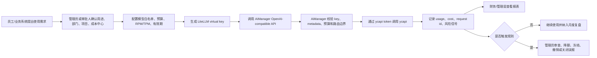
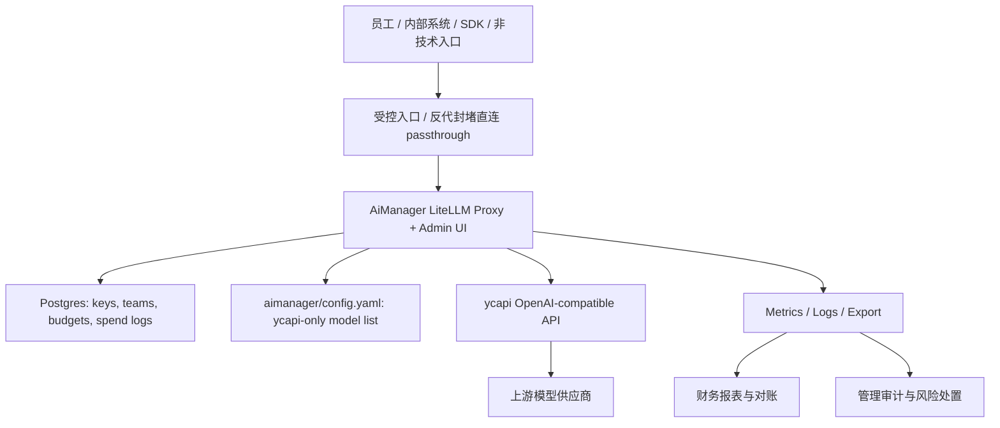

# AiManager 需求文档 v3

日期：2026-06-29

## 0. v3 变更摘要

v3 基于 Claude 综合评审和六类角色评审修订，重点补齐：

- LiteLLM provider passthrough 路由的 ycapi-only 防绕过要求。
- 非零计价、预算阻断、月度对账和费用归集规则。
- LiteLLM metadata 与扩展表的数据落地口径。
- RBAC、业务管理台信息架构和页面四态矩阵。
- OpenAI SDK 兼容矩阵、错误响应契约、mock/live 验证矩阵。
- 市场内容生产流程、品牌安全、场景标签字典和非技术员工入口。
- 总经理关注的 ROI、推广闭环、合规边界和轻量经营总览。

## 1. 背景与目标

公司采购的大模型 API 需要统一管理，既要方便员工和内部系统使用，也要控制成本、降低私用和滥用风险、满足审计追溯要求。AiManager 基于 LiteLLM，保留 key、team、budget、usage、admin UI 等管理能力，并将已配置的上游模型调用统一收敛到 ycapi。

本项目不承诺由 API 网关自动判断每一次请求是否绝对属于工作。v1 的目标是建立可执行的治理闭环：实名使用、用途和成本中心可追踪、权限和预算可限制、异常使用可发现、违规 key 可停用、财务和管理层可复盘。

## 2. 经营成功指标

| 指标 | M1 本地验证 | M2 试点 | M3 推广 |
| --- | --- | --- | --- |
| 上游合规 | 所有可用上游路径均被证明只走 ycapi，passthrough 直连路径被封堵 | 试点团队 100% 使用 AiManager virtual key | 公司统一入口，ycapi token 不外发 |
| 成本可控 | 非零计价与预算阻断可真实触发 | 试点部门月度成本可归集到部门/项目/员工/key | 月度经营复盘可输出异常用量和节省建议 |
| ROI | 记录项目投入、人力和运行成本基线 | 建立试点前后费用、异常用量、手工对账耗时对比 | 形成回收周期和节省额评估 |
| 风险处置 | key 冻结/撤销/超预算阻断可验证 | 风险事件有 DRI、SLA 和关闭记录 | 异常或疑似私用可追责、可培训、可整改 |
| 采用率 | 开发者接入样例跑通 | 试点团队目标活跃率 >= 70% | 新增大模型 API 使用默认走 AiManager |

## 3. 参与角色与核心诉求

| 角色 | 核心诉求 | P0/M1 约束 | M2/M3 约束 |
| --- | --- | --- | --- |
| 公司总经理 | ROI、管理闭环、推广可控 | 要有轻量经营总览和风险台账 | 要有推广制度、培训、影子 API 防控 |
| 开发人员 | 接入简单、兼容 OpenAI SDK、错误可诊断 | Python/Node/curl 示例、错误契约、request id | 更多 SDK 和业务系统迁移指南 |
| 市场人员 | 安全产出文案、资料、活动和客户沟通内容 | 场景标签、品牌安全规则、外发审批要求 | 非技术入口、模板库、复盘报表 |
| 财务人员 | 成本归集、预算控制、对账清晰 | 非零计价、价格版本、预算阻断、报表导出 | 月结、冲销、差异处理和发票/账单对账 |
| 架构师 | 上游边界清晰、可扩展、可观测、可恢复 | ycapi-only、passthrough 封堵、日志指标、故障验证 | 高可用、secret manager、token 轮换 |
| UI/UED | 管理流程清楚，低学习成本 | RBAC、IA、四态矩阵、术语翻译 | 自研业务门户或 WeCom/轻量入口 |

## 4. 产品分层与 MVP 边界

### 4.1 M1 P0：平台治理底座

1. **统一 API 入口**：内部应用和员工只使用 AiManager 分发的 base URL 与 virtual key。
2. **ycapi-only 运行时边界**：`model_list`、管理配置、passthrough、反代路由和部署配置均不得形成直连供应商路径。
3. **实名与组织归属**：每个 key 绑定员工、部门、项目、成本中心和业务场景；共享 key 必须强制传入最终使用人或系统主体 metadata。
4. **模型白名单**：M1 只开放 `gemini-2.5-flash`、`deepseek-chat`、`ycapi-image-1`；`ycapi-video-1` 暂缓。
5. **非零计价与预算阻断**：预算、报表和超预算阻断必须基于已审批的非零 AiManager 计价版本。
6. **使用审计**：记录调用时间、调用方、key、模型、endpoint、token/图片数量、费用、状态码、错误原因、request id、业务 metadata；默认不保存完整 prompt/response。
7. **管理处置**：管理员可冻结、撤销、降额 key，并保留处置人、处置时间、原因和备注。
8. **财务导出**：按日期、部门、项目、员工、成本中心、key、模型、endpoint 汇总调用次数、费用、失败率和预算消耗。
9. **轻量经营总览**：M1 至少交付导出报表和一页轻量总览，展示本月费用、预算消耗、异常事件、TOP 部门/项目/key。

### 4.2 M2 P0：业务试点前置条件

1. 市场内容生产流程、场景标签字典、品牌安全规则和外发审批记录可用。
2. 非技术员工有明确入口：WeCom Bot、轻量网页、模板表单，或由部门管理员代操作。
3. 财务完成月度对账闭环和关账机制。
4. 总经理、财务、部门管理员可以看到业务化报表，不依赖 LiteLLM 英文技术页面理解经营状态。
5. 员工监控、非工作时间异常、内容采样如启用，必须先完成内部制度告知和权限边界确认。

### 4.3 P1/P2 后续增强

- 企业微信审批和通知：key 申请、额度调整、异常告警进入 WeCom。
- DLP 与敏感信息检测：对 prompt/response 做脱敏采样或拦截策略。
- 工作用途风险评分：基于场景、时间、内容特征做风险评分，而不是直接阻断全部可疑请求。
- ycapi video adapter：以明确的异步创建和轮询语义接入 `ycapi-video-1`。
- 自研业务管理 UI：面向总经理、财务、部门管理员和市场人员的轻量门户。

### 4.4 明确不做

- 不接入直连 OpenAI、Anthropic、Gemini、Azure、Bedrock、Vertex 等供应商 key。
- 不把 ycapi token 下发给员工或业务系统。
- 不默认存储完整 prompt/response 正文。
- 不承诺完全自动识别并阻止所有非工作用途。
- 不在 M1 将 LiteLLM Admin UI 当作最终业务门户。

## 5. 端到端流程



## 6. 功能需求

### FR-01 ycapi-only 边界与防绕过

Given AiManager 启动时加载模型配置
When 配置中出现直连供应商 base、供应商 key、`openai/*` 通配或未审计 video 配置
Then 配置校验必须失败，并明确指出违规项。

Given LiteLLM 完整 proxy 默认可能挂载 provider passthrough route
When 部署 AiManager
Then `/anthropic/`、`/gemini/`、`/bedrock/`、`/vertex_ai/`、`/openai/`、`/openai_passthrough/`、`/cohere/`、`/vllm/`、`/mistral/`、`/azure/`、`/azure_ai/` 等直连供应商路径必须通过反代、应用配置或代码开关返回 403/404，且不得命中上游供应商。

Given 管理员使用 LiteLLM Admin UI
When 尝试新增直连 provider、修改 model config 或启用 DB 模型存储
Then 系统必须阻止、回滚或触发漂移告警；ycapi-only 是部署级不可变约束。

### FR-02 Key 生命周期与状态机

Key 状态包括：`active`、`rotating`、`frozen`、`revoked`、`expired`、`budget_limited`。

Given 管理员创建 key
When 提交申请
Then 必填字段为所有者、部门、项目、成本中心、业务场景、模型范围、预算、RPM/TPM、有效期、审批人。

Given key 进入 `frozen`、`revoked`、`expired` 或 `budget_limited`
When 后续请求到达
Then 请求必须被拒绝或按策略降级，并记录处置原因。

### FR-03 工作用途治理与场景标签

场景标签字典：

| 一级场景 | 二级标签 |
| --- | --- |
| 研发 | 代码辅助、测试生成、技术文档、故障排查 |
| 市场 | 活动策划、公众号/新闻稿、销售资料、客户邮件、行业研究、竞品分析、图片素材 |
| 经营管理 | 会议纪要、数据分析、汇报材料、制度草案 |
| 客户支持 | FAQ、工单摘要、客户回复草稿 |
| 内部协作 | 翻译、总结、检索、培训材料 |

每次使用至少记录：一级场景、二级标签、内用/外发、项目或客户、敏感级别、审批要求。共享 key 必须通过 metadata 透传最终使用主体；无法透传的系统不得进入公司级推广。

### FR-04 市场内容生产与品牌安全

Given 市场人员使用 AiManager 产出外发内容
When 进入市场试点
Then 必须经过 brief、生成草稿、人工审核、定稿、外发、归档、复盘流程。

P0-M2 品牌安全规则至少覆盖：品牌语气、禁用承诺、价格/效果宣称、竞品比较、客户案例、版权素材、人物肖像、事实核查、外发审批。M1 只需把这些规则写入制度和标签；M2 试点前必须有可执行入口。

### FR-05 预算、计价、对账与成本归集

预算是财务控制上限；RPM/TPM 是技术限流；实际费用以调用时的价格版本、模型用量和计费规则计算。预算阻断按实时预估费用触发，月结金额按已确认调用和价格快照固化。

计价规则必须明确：币种、含税/不含税、模型单价版本、生效时间、最小计费单位、四舍五入规则、失败请求是否计费、streaming 是否按最终 usage 计费、image 是否按成功返回图片数量计费。M1 禁止以 `0.0` 价格进入预算验收。

归集优先级：`key.project_id` > `request.metadata.project_id` > `team.default_project_id` > `employee.department_id` > `unassigned`。进入 `unassigned` 的费用必须在月结前补齐归属，否则不得关账。

月度对账流程：AiManager usage/spend 导出与 ycapi 账单、发票或充值消耗按月对账；差异字段包括月份、模型、token/图片数、金额、币种、税费、key、部门、项目。差异容忍阈值默认 1% 或 10 元人民币，以较大者为准；超阈值由财务和系统管理员共同确认。

### FR-06 审计、日志与可观测

每次调用至少生成 request id，并贯穿 AiManager 日志、LiteLLM usage/spend、ycapi 响应关联字段。默认不保存完整 prompt/response；如启用内容采样，必须脱敏、限定权限、设置保留期。

指标至少包括请求数、失败率、延迟、token/图片数、费用、key/team/model、429/5xx、预算阻断次数、撤销 key 拦截次数、passthrough 拦截次数。

日志保留建议：usage 24 个月，财务报表 36 个月，风险事件 24 个月，管理操作日志 36 个月，脱敏采样内容不超过 90 天。

### FR-07 OpenAI SDK 兼容与开发者体验

M1 支持矩阵：

| 能力 | 状态 | 说明 |
| --- | --- | --- |
| Python OpenAI SDK | 支持 | `base_url` 必须包含 AiManager `/v1`，使用 LiteLLM virtual key |
| Node OpenAI SDK | 支持 | 同 Python |
| curl | 支持 | 文档必须给 chat/image 示例 |
| Chat text | 支持 | `gemini-2.5-flash`、`deepseek-chat` |
| Chat streaming | 需验证 | M1 live smoke 确认；不把首包延迟收益作为承诺 |
| Vision | 受限支持 | 只接受 base64 `data:` URL；不承诺抓取远程图片 URL |
| Image generation | 受限支持 | 首选 `response_format: b64_json`；`n`、`size`、`quality` 以 ycapi 实际支持为准 |
| tool calls / JSON mode / response_format | 需验证 | 未通过 M1 live smoke 前不作为承诺能力 |
| img2img / multimodal generate / ycapi usage | 不支持 | 属 ycapi 专有路径，M1 不映射 |
| video | 不支持 | 需单独 adapter 或审计 passthrough |

错误响应应保持 OpenAI-compatible error JSON：

```json
{
  "error": {
    "message": "human-readable sanitized message",
    "type": "invalid_request_error | authentication_error | permission_error | rate_limit_error | upstream_error",
    "code": "stable_error_code",
    "param": null
  },
  "request_id": "..."
}
```

401 表示无效 key，403 表示无权限或被封禁路径，404 表示模型或路径不存在，429 表示预算/频率/上游限流，5xx 表示系统或上游故障。错误中不得出现 `YCAPI_API_TOKEN`、数据库密码或上游供应商密钥。

### FR-08 管理控制台与业务门户

M1 保留 LiteLLM Admin UI 作为技术管理入口，同时提供轻量经营总览或导出报表。M2 前必须明确是否新增业务门户、WeCom Bot 或轻量网页。

信息架构目标：

```text
总览
  -> 用量报表
      -> 部门 / 项目 / 员工 / Key 明细
  -> Key 管理
      -> 创建 / 冻结 / 撤销 / 轮换 / 复制接入信息
  -> 预算管理
      -> 预算阈值 / 限流 / 预警对象
  -> 风险事件
      -> 处置 / 误报 / 关闭 / 复发记录
  -> 审计日志
```

业务 UI 文案应把 technical term 转译为业务表达：virtual key = 访问凭证，RPM = 每分钟请求上限，TPM = 每分钟用量上限，token = 文本用量单位，P95 = 95% 请求的系统响应耗时。

## 7. RBAC 权限矩阵

| 角色 | 可见范围 | 可操作 | 导出 | 费用可见 | 个人明细 |
| --- | --- | --- | --- | --- | --- |
| 超级管理员 | 全部 | 系统配置、模型、key、预算、冻结撤销 | 全部 | 是 | 是 |
| 系统管理员 | 全部技术对象 | key、team、配置校验、故障处理 | 技术报表 | 可选 | 是 |
| 总经理 | 公司汇总和下钻 | 查看、批注、要求整改 | 汇总报表 | 是 | 仅必要下钻 |
| 财务 | 全部费用和对账 | 预算、关账、调整备注 | 财务报表 | 是 | 是 |
| 部门管理员 | 本部门 | key 申请、额度申请、冻结建议 | 本部门 | 是 | 本部门 |
| 开发者 | 自己和授权项目 | 查看接入信息、调试 request id | 自己/项目 | 可选 | 自己/项目 |
| 普通员工 | 自己 | 查看凭证状态和使用规范 | 否 | 否或个人费用 | 自己 |
| 审计只读 | 全部审计 | 无写操作 | 审计报表 | 是 | 是 |

## 8. UI 四态矩阵

| 页面 | Happy path | 空状态 | 错误状态 | 权限受限 |
| --- | --- | --- | --- | --- |
| 总览 | 展示本月费用、预算、异常、TOP 部门/项目/key | “暂无本月调用，完成接入后显示趋势” | 展示数据加载失败、重试和导出离线报表入口 | 展示当前角色可见范围和申请权限入口 |
| Key 管理 | 创建、冻结、撤销、轮换、复制接入信息 | “暂无访问凭证，创建第一个凭证” | 创建失败展示字段错误或系统错误 | 禁用高危按钮，说明需联系管理员 |
| 预算管理 | 设置预算、阈值、预警对象和限流 | “暂无预算规则，使用默认公司额度” | 保存失败可重试，不丢失表单 | 只能查看，不能修改 |
| 用量报表 | 筛选、下钻、导出 CSV/XLSX | “当前筛选范围无数据” | 导出失败保留任务记录 | 隐藏无权费用和个人明细 |
| 风险事件 | 处置、误报、关闭、复发记录 | “暂无风险事件” | 处置失败保留草稿备注 | 只能查看事件摘要 |
| 审计日志 | 按人、key、操作、时间检索 | “暂无审计记录” | 检索失败提供 request id | 敏感字段脱敏 |

## 9. 数据模型落地

| 概念 | M1 落地方式 |
| --- | --- |
| 员工 | LiteLLM user 或 key metadata：`employee_id`、`employee_name`、`department_id`、`status` |
| 部门/团队 | LiteLLM team metadata：`department_id`、`cost_center_id`、`owner_id` |
| 项目 | key/team/request metadata：`project_id`、`project_name`、`project_owner` |
| 成本中心 | key/team metadata：`cost_center_id`；费用归集必填 |
| 用途标签 | request metadata 或 key metadata：`scenario_l1`、`scenario_l2`、`internal_or_external` |
| 价格版本 | 配置或扩展表：`pricing_version`、`effective_at`、`currency`、`unit_price` |
| 风险事件 | M1 可用导出/日志台账，M2 建扩展表 |
| 处置记录 | 管理操作日志 + 风险事件台账 |
| 对账记录 | 财务导出文件 + 月结记录，M2 建扩展表 |

## 10. 安全、合规与员工监控边界

- Admin UI 必须限制在内网、VPN 或受控入口；master key 需要轮换机制。
- `.env` 必须在 `.gitignore`；生产优先使用 secret manager，不在日志和文档回显密钥。
- ycapi token 泄漏时必须立即轮换、冻结旧 token、审计最近调用、通知受影响管理员。
- 员工非工作时间异常、key 共享迹象等监控必须有制度告知和权限边界；不得做无告知的个人隐私监控。
- 由于模型可能涉及境外服务或跨境处理，试点前需要确认数据分类、是否允许输入客户数据/个人信息/商业秘密，以及相关制度。
- 默认不保存完整 prompt/response。市场最终稿和审批记录可以保存，但不得保存未经脱敏的敏感 prompt。

## 11. 运行风险与退出条件

| 场景 | M1 要求 |
| --- | --- |
| ycapi 429 | 返回 429，记录 key/model/request id，不自动切直连供应商 |
| ycapi 5xx/超时 | 返回可解释 upstream_error，记录 retryable，触发告警 |
| Postgres 不可用 | 管理面不可用时有健康检查和明确错误，不静默放行未授权请求 |
| 配置错误 | 启动或 CI 校验失败，不进入运行状态 |
| passthrough 未封堵 | M1 FAIL，不得上线 |
| 价格为 0.0 | M1 财务验收 FAIL，预算阻断不得标 PASS |
| master key 泄漏 | 轮换 master key，审计高危操作 |
| 预算池耗尽 | 阻断或降级，通知管理员和财务，不调用直连供应商兜底 |

## 12. 技术架构



M1 继续使用完整 LiteLLM proxy/admin 进程，不启用 `gateway/` data-plane-only 形态；但必须额外封堵完整 proxy 自带的 provider passthrough 路由。

## 13. 环境变量

| 变量 | 必填 | 说明 |
| --- | --- | --- |
| `LITELLM_MASTER_KEY` | 是 | LiteLLM 管理 key，不能提交 |
| `YCAPI_BASE_URL` | 是 | ycapi base URL，默认 `https://ycapi.ycaicloud.com/v1` |
| `YCAPI_API_TOKEN` | 是 | ycapi 下游 token，不能下发给员工 |
| `POSTGRES_DB` | 是 | 管理库名称 |
| `POSTGRES_USER` | 是 | 管理库用户 |
| `POSTGRES_PASSWORD` | 是 | 管理库密码，不能提交 |

## 14. 验收标准摘要

详细验收矩阵见 `docs/aimanager/1_acceptance_criteria.md`。M1 最低退出条件：

- ycapi-only 静态配置和运行时路由封堵均 PASS。
- 非零计价、spend 记录和预算阻断均 PASS。
- key 创建、撤销、冻结、归属 metadata 和审计均 PASS。
- mock ycapi 正向/负向用例 PASS；缺真实 token 的 live smoke 只能标 BLOCKED。
- SDK 兼容矩阵中已承诺能力有 curl/Python/Node 示例和错误契约验证。
- Admin UI 高权限面、RBAC、内网/VPN/访问控制有明确部署要求。

## 15. 里程碑

| 阶段 | 目标 | 退出条件 |
| --- | --- | --- |
| M0 文档评审 | PRD、验收标准、多角色评审完成 | v3 返工项完成；未达 90 的风险显式登记 |
| M1 本地技术验证 | 管理面、配置、封堵、预算、mock/live smoke | P0 技术验收无 FAIL；live 缺密钥可 BLOCKED |
| M2 业务试点 | 选择 1-2 个部门或项目试用 | 采用率、报表、对账、风险处置、市场流程可用 |
| M3 公司推广 | 纳入统一大模型 API 使用规范 | 员工只领取 AiManager virtual key，影子 API 有制度约束 |

## 16. 开放问题

1. 公司采用 showback（只展示费用）还是 chargeback（部门实际分摊/结算）。
2. AiManager 自身转售价由谁审批，多久更新一次。
3. 哪些数据类型允许进入境外模型或 ycapi 上游，哪些必须禁止。
4. M2 非技术入口优先做 WeCom Bot、轻量网页，还是部门管理员代操作。
5. 管理总览是先用导出报表生成，还是直接做自研页面。
