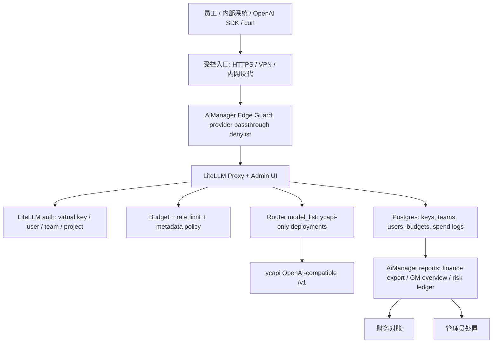

# AiManager 详细设计 v1 - Codex 版

日期：2026-06-29

## 1. 设计结论

AiManager 的 M1 采用“完整 LiteLLM Proxy + 不可变 ycapi 治理边界 + 轻量经营导出”的设计。

核心判断：

- 保留 LiteLLM Proxy/Admin UI，而不是使用 `gateway/` data-plane-only 形态；原因是 M1 必须保留 virtual keys、teams、budgets、rate limits、usage/spend logs 和管理 UI。
- ycapi-only 不能只靠 `aimanager/config.yaml`，必须同时覆盖静态配置、运行时路由、管理面漂移和数据库加载路径。
- provider passthrough 是 M1 最大绕过面。源码中 `litellm/proxy/proxy_server.py:15444` 直接挂载 `llm_passthrough_router`，`litellm/proxy/pass_through_endpoints/llm_passthrough_endpoints.py` 注册 `/gemini/`、`/anthropic/`、`/bedrock/`、`/vertex_ai/`、`/openai/`、`/openai_passthrough/`、`/cohere/`、`/vllm/`、`/mistral/`、`/azure/`、`/azure_ai/` 等 provider-specific routes；M1 必须在入口层封堵，并在应用层补兜底。
- M1 先用 LiteLLM 既有 key/team/user/project metadata、budget、spend logs 做治理闭环；只有 LiteLLM 原生字段无法稳定承载的财务对账、风险事件、价格版本，才通过 AiManager 扩展导出或扩展表补齐。
- M1 不承诺自动判断所有“是否工作用途”。系统交付的是实名、场景、预算、审计、异常发现和处置闭环。

## 2. 目标与非目标

### 2.1 目标

| 编号 | 目标 | 设计实现 |
| --- | --- | --- |
| G1 | 员工和内部系统只拿 AiManager base URL 与 LiteLLM virtual key | Admin UI 创建 key；文档和 SDK 示例只暴露 AiManager `/v1` |
| G2 | 所有已配置上游模型只走 ycapi | `model_list` 使用 OpenAI-compatible ycapi base，禁直连 provider key/base |
| G3 | 防止 passthrough 绕过 ycapi-only | 入口层 denylist、应用层 deny middleware、DB/config 漂移检查、验收 curl |
| G4 | 保留 LiteLLM 管理能力 | 完整 proxy/admin 进程 + Postgres |
| G5 | 成本可控和可对账 | 非零计价、价格版本、spend logs、财务导出、月度对账 |
| G6 | 开发者低成本接入 | OpenAI SDK compatible chat/image 示例与错误契约 |
| G7 | 管理层、财务、市场可试点 | M1 导出报表和轻量总览；M2 业务门户或 WeCom 入口 |

### 2.2 非目标

- 不接入 OpenAI、Anthropic、Gemini、Azure、Bedrock、Vertex 等供应商直连 key。
- 不把 `YCAPI_API_TOKEN` 下发给员工、业务系统或前端页面。
- 不默认保存完整 prompt/response 正文。
- 不在 M1 做完整自研业务门户。
- 不在 M1 支持 `ycapi-video-1`；video 需要单独 adapter 或经过审计的异步 passthrough。
- 不承诺用模型内容自动判定所有非工作用途。

## 3. 架构总览



M1 部署单元：

| 组件 | 形态 | 责任 |
| --- | --- | --- |
| Edge Guard | Nginx/Caddy/Traefik 或平台入口规则 | 封堵 provider passthrough，限制 Admin UI 暴露面 |
| LiteLLM Proxy | 现有完整 proxy/admin | API 兼容、key/team/budget/spend/admin |
| Postgres | LiteLLM 管理库 | 保存 key、team、budget、usage、spend logs |
| AiManager validator | Python 脚本 + CI | 校验 config ycapi-only、非零计价、禁止 DB 模型存储 |
| AiManager reports | M1 脚本或 SQL 视图 | 经营总览、财务导出、对账输入 |
| Mock ycapi | M1 测试服务 | 正向、负向、错误契约、预算阻断验证 |

## 4. 关键实现锚点

| 能力 | LiteLLM 源码锚点 | AiManager 设计处理 |
| --- | --- | --- |
| Proxy 路由挂载 | `litellm/proxy/proxy_server.py:15444 app.include_router(llm_passthrough_router)` | Edge Guard 必须默认拒绝 passthrough provider path；应用层增加 deny 兜底 |
| 动态 passthrough | `litellm/proxy/pass_through_endpoints/pass_through_endpoints.py:2617 initialize_pass_through_endpoints`、`:2721 _get_pass_through_endpoints_from_db` | 禁止 `general_settings.pass_through_endpoints` 写入非 ycapi endpoint；CI 和启动校验检查 DB/config |
| 静态模型清单 | `litellm/proxy/proxy_server.py:3943 ProxyConfig.load_config`、`:4495 model_list` | `aimanager/config.yaml` 作为 M1 模型 SSOT |
| DB 模型存储 | `litellm/proxy/proxy_server.py:1916 store_model_in_db: bool = False`、`:7491 STORE_MODEL_IN_DB` | M1 强制 `STORE_MODEL_IN_DB=false`；漂移时启动失败或健康检查 FAIL |
| key 元数据 | `litellm/proxy/management_endpoints/key_management_endpoints.py:3380 generate_key_helper_fn` | key metadata 保存员工、部门、项目、成本中心、场景 |
| auth 结果对象 | `litellm/proxy/_types.py:2420 UserAPIKeyAuth` | 请求链路获取 key/team/user/project/budget 上下文 |
| spend logs | `litellm/proxy/spend_tracking/spend_tracking_utils.py:391 SpendLogsPayload` | M1 导出和财务对账以 spend logs 为主证据 |
| 日聚合 | `litellm/proxy/db/db_spend_update_writer.py` daily user/team/org/end_user/tag spend | M1 用于总览和报表，字段不足时从 spend logs 补明细 |
| Dashboard 管理面 | `ui/litellm-dashboard/src/app/(dashboard)/models-and-endpoints/ModelsAndEndpointsView.tsx` 包含 pass-through tab | M1 保留管理面但通过权限、文案和配置禁止新增直连 passthrough |

## 5. ycapi-only 边界设计

### 5.1 静态配置边界

M1 `aimanager/config.yaml` 必须满足：

- `model_list` 只包含 `gemini-2.5-flash`、`deepseek-chat`、`ycapi-image-1`。
- 每个 deployment 使用 OpenAI-compatible 模式访问 `YCAPI_BASE_URL`。
- `api_key` 只允许引用 `os.environ/YCAPI_API_TOKEN`。
- `api_base` 只允许引用 `os.environ/YCAPI_BASE_URL` 或默认 `https://ycapi.ycaicloud.com/v1`。
- 禁止供应商专有 key/env：`OPENAI_API_KEY`、`ANTHROPIC_API_KEY`、`GEMINI_API_KEY`、`GOOGLE_API_KEY`、`AZURE_API_KEY`、`AWS_*` 等。
- 禁止 `openai/*` 通配或未审计模型泛化；M1 每个模型必须显式列出。
- 禁止 `ycapi-video-1` 进入 `model_list`。
- `general_settings.store_model_in_db` 必须为 `false`。
- `general_settings.pass_through_endpoints` 必须为空或不存在。
- `store_prompts_in_spend_logs` 默认为 `false`。

现有 `aimanager/scripts/validate_config.py` 是静态边界的第一层。M1 后续应扩展成四类检查：

| 检查 | 失败条件 |
| --- | --- |
| provider key/base | 出现直连供应商 env、base URL 或 provider-specific param |
| model whitelist | 模型名不在 M1 白名单；或出现 video |
| pricing | 已开放模型缺少非零价格版本 |
| management drift | `store_model_in_db=true`、`pass_through_endpoints` 非空、危险 general settings |

### 5.2 运行时 passthrough 封堵

M1 采用双层封堵。

第一层：Edge Guard denylist。

拒绝路径：

```text
/anthropic/*
/gemini/*
/bedrock/*
/vertex_ai/*
/vertex-ai/*
/openai/*
/openai_passthrough/*
/cohere/*
/vllm/*
/mistral/*
/azure/*
/azure_ai/*
/assemblyai/*
/eu.assemblyai/*
/cursor/*
```

返回要求：

- 对 API 调用返回 403，error code 为 `aimanager_passthrough_blocked`。
- 不转发到 LiteLLM 上游 provider route。
- 记录 `request_id`、path、method、key hash 或匿名标记、client ip、block reason。

第二层：应用层 deny middleware。

原因：

- 部署层规则可能被绕过，例如测试环境直接访问 proxy 容器端口。
- LiteLLM 完整 proxy 默认挂载 provider passthrough router。
- 动态 pass-through endpoints 可来自 DB/config，不能只靠反代路径表。

实现建议：

- 在 M1-A 增加 `aimanager/edge` 反代配置。
- 在 M1-B 增加轻量 FastAPI middleware 或 startup guard，位于 LiteLLM app 启动后、路由处理前。
- middleware 读取 `AIMANAGER_BLOCKED_PROVIDER_PATHS`，默认开启，匹配 path prefix 后直接返回 OpenAI-compatible error。
- 对 `/v1/chat/completions`、`/v1/images/generations`、`/v1/models`、`/health/*`、受控 `/ui` 与管理 API 放行。

验收：

```bash
for p in anthropic gemini bedrock vertex_ai vertex-ai openai openai_passthrough cohere vllm mistral azure azure_ai; do
  curl -i "http://localhost:4000/$p/test"
done
```

所有响应必须是 403/404，且 mock ycapi 和任何直连供应商 mock 都无请求记录。

### 5.3 管理漂移控制

漂移来源：

- Admin UI 新增模型或切换 `store_model_in_db`。
- Config API 写入 `general_settings.pass_through_endpoints`。
- DB 中已有模型或 passthrough endpoint 被加载。
- 运行环境注入供应商直连 key。

M1 控制：

| 漂移点 | 控制方式 |
| --- | --- |
| DB 模型加载 | `STORE_MODEL_IN_DB=false`，启动检查 `store_model_in_db` 最终值 |
| DB passthrough | 启动后调用管理 API 或 DB 查询，发现非空 passthrough 直接 FAIL health |
| UI 新增直连模型 | M1 不把 UI 模型新增作为允许流程；管理员模型变更必须走 Git 配置变更和 CI |
| 供应商 env 注入 | 容器 env allowlist；secret scan；启动校验 |
| 配置热更新 | reload 前执行 validator；失败不应用 |

设计原则：M1 的模型和上游配置是 Git-managed，不是 UI-managed。LiteLLM Admin UI 用于 key/team/budget/usage，不用于改变上游供应商边界。

## 6. LiteLLM 管理能力保留与映射

### 6.1 对象映射

| AiManager 概念 | LiteLLM 落地 | 必填字段 |
| --- | --- | --- |
| 员工 | `user_id` + user metadata 或 key metadata | `employee_id`、`employee_name`、`department_id`、`status` |
| 部门 | team 或 organization metadata | `department_id`、`department_name`、`cost_center_id`、`owner_id` |
| 项目 | key/project/team metadata，必要时 `project_id` 字段 | `project_id`、`project_name`、`project_owner` |
| 成本中心 | key/team metadata | `cost_center_id`、`cost_center_name` |
| 使用场景 | request metadata 或 key metadata | `scenario_l1`、`scenario_l2`、`internal_or_external` |
| 审批 | key metadata + 操作日志 | `approver_id`、`approval_source`、`approved_at` |
| 价格版本 | model_info 或 AiManager 扩展配置 | `pricing_version`、`currency`、`effective_at` |

### 6.2 metadata 合并规则

请求有效 metadata 由三层合并：

1. key metadata：管理员创建 key 时写入，可信度最高。
2. team/project metadata：提供默认部门、成本中心和项目归属。
3. request metadata：用于本次调用场景、客户、外发标记、最终使用主体。

合并规则：

- `employee_id`、`department_id`、`cost_center_id` 默认不允许客户端覆盖。
- `project_id` 允许 request metadata 覆盖 key 默认项目，但必须在 key 授权项目范围内。
- `scenario_l1`、`scenario_l2`、`internal_or_external` 可由 request metadata 提供；如果 key 是单一场景 key，也可由 key metadata 固化。
- 共享 key 必须在 request metadata 提供 `end_user_id` 或 `system_actor_id`；缺失时 400/403。
- `metadata.tags` 不允许客户端随意影响预算聚合；LiteLLM 已有 `reject_clientside_metadata_tags` 设置，应在 M1 打开。

### 6.3 key 生命周期

状态设计：

| 状态 | LiteLLM 字段/策略 | 请求行为 |
| --- | --- | --- |
| `active` | `blocked=false`、未过期、预算未耗尽 | 放行 |
| `rotating` | 新旧 key 并存，旧 key 有短有效期 | 旧 key 告警，新 key 放行 |
| `frozen` | `blocked=true` + metadata reason | 403 |
| `revoked` | delete/revoke key + deleted token record | 401/403 |
| `expired` | `expires` 到期 | 401/403 |
| `budget_limited` | spend >= max_budget 或预算窗口耗尽 | 429 |

管理操作必须写入：

- 操作人、时间、动作、对象 key hash、原因、备注、审批来源。
- 高风险动作包括创建 master-level key、放大预算、启用模型、解冻、撤销恢复。

## 7. 计价、预算、报表和对账

### 7.1 非零计价

M1 禁止使用全 0 价格做预算验收。

计价配置包含：

| 字段 | 说明 |
| --- | --- |
| `pricing_version` | 例如 `aimanager-2026-06-m1` |
| `currency` | 默认 `CNY` |
| `tax_mode` | `tax_included` 或 `tax_excluded` |
| `effective_at` | 生效时间 |
| `model_name` | 对外模型名 |
| `endpoint_type` | chat / image |
| `unit` | input token / output token / image |
| `unit_price` | 非零价格 |
| `rounding` | 金额四舍五入规则 |
| `failed_request_billing` | 失败请求是否计费 |

价格快照必须在调用记录中可追溯。M1 可先把 `pricing_version` 写入 key/model metadata 和 spend log metadata；M2 如需严肃财务结算，再建扩展表。

### 7.2 预算阻断

预算控制分三层：

| 层级 | 控制对象 | 用途 |
| --- | --- | --- |
| key budget | 单个访问凭证 | 员工或系统级限额 |
| team/project budget | 部门、项目 | 组织成本上限 |
| global ycapi token budget | 总入口 | 避免上游统一 token 被打爆 |

阻断逻辑：

1. 请求进入后先做 key 状态、模型范围、RPM/TPM 校验。
2. 基于当前 spend + 预估请求成本做预算预检查。
3. 允许请求后记录最终 usage 和 `response_cost`。
4. 超预算后返回 429，错误 code 为 `budget_exceeded` 或 AiManager 映射后的稳定 code。
5. 并发预算需要开启 LiteLLM 预算保留机制；禁止开启 `disable_budget_reservation`，除非有明确事故审批。

### 7.3 usage/spend 记录

每次调用至少保留：

- request id
- key hash、key alias
- user_id、team_id、project_id、department_id、cost_center_id
- model、endpoint、call_type
- prompt_tokens、completion_tokens、total_tokens 或 image count
- response_cost、currency、pricing_version
- status code、error type、retryable、latency
- scenario_l1、scenario_l2、internal_or_external
- upstream request id 或 ycapi correlation id

默认不保存完整 prompt/response。若开启采样，必须脱敏、最小权限、独立开关和 90 天以内保留期。

### 7.4 财务导出与月度对账

M1 导出文件：

| 文件 | 粒度 | 用途 |
| --- | --- | --- |
| `aimanager_usage_daily.csv` | 日期 + 部门 + 项目 + key + 模型 | 日常运营 |
| `aimanager_finance_monthly.csv` | 月份 + 成本中心 + 项目 + 模型 | 财务归集 |
| `aimanager_reconciliation.csv` | AiManager vs ycapi 账单 | 差异处理 |
| `aimanager_risk_events.csv` | 预算阻断、passthrough 拦截、异常 key | 管理复盘 |

对账规则：

- AiManager 月度金额以 spend logs 聚合为主。
- ycapi 账单、发票或充值消耗为外部对照。
- 差异阈值为 1% 或 10 元人民币，以较大者为准。
- 超阈值由财务和系统管理员确认，记录处理结论：价格差异、四舍五入、失败请求、漏记归属、上游账单延迟或系统缺陷。
- `unassigned` 成本不得关账；必须补齐部门/项目/成本中心或由财务标记处理。

## 8. API 与错误契约

### 8.1 支持 endpoint

M1 对外承诺：

- `GET /v1/models`
- `POST /v1/chat/completions`
- `POST /v1/images/generations`
- 健康检查和受控管理面

M1 不承诺：

- provider passthrough path
- ycapi 专有 video API
- img2img / multimodal generate / provider-specific APIs
- 未经 smoke test 的 tool calls、JSON mode、response_format 高级能力

### 8.2 SDK 兼容

| 客户端 | M1 要求 |
| --- | --- |
| curl | chat/image 正向和错误示例 |
| Python OpenAI SDK | `base_url="${AIMANAGER_BASE_URL}/v1"`，virtual key |
| Node OpenAI SDK | 同 Python |
| streaming | live smoke 通过后标支持；未通过前只标“需验证” |
| vision | 只承诺 base64 `data:` URL |
| image | 优先 `response_format=b64_json`，参数以 ycapi 实际能力为准 |

### 8.3 错误响应

统一返回 OpenAI-compatible error：

```json
{
  "error": {
    "message": "sanitized message",
    "type": "authentication_error | permission_error | invalid_request_error | rate_limit_error | upstream_error",
    "code": "stable_error_code",
    "param": null
  },
  "request_id": "req_..."
}
```

错误映射：

| HTTP | 场景 | code |
| --- | --- | --- |
| 400 | metadata 缺失、参数不支持 | `invalid_request` |
| 401 | key 缺失或无效 | `invalid_api_key` |
| 403 | provider passthrough、key frozen/revoked、无模型权限 | `aimanager_passthrough_blocked` / `permission_denied` |
| 404 | 模型或路径不存在 | `not_found` |
| 429 | 预算、RPM/TPM、ycapi 限流 | `budget_exceeded` / `rate_limited` |
| 5xx | AiManager 或 ycapi 故障 | `upstream_error` / `internal_error` |

错误消息不得包含 token、数据库密码、ycapi token、供应商 key、完整 prompt/response。

## 9. RBAC 与 UI 边界

### 9.1 M1 管理面

M1 保留 LiteLLM Admin UI，用途限定：

- 创建、冻结、撤销、轮换 key。
- 管理 teams、budgets、rate limits。
- 查看 usage/spend logs。
- 管理用户和基础 RBAC。

M1 禁止把 Admin UI 当最终业务门户：

- 总经理、财务、市场人员不应依赖 LiteLLM 英文技术页面理解经营状态。
- M1 通过导出报表和一页轻量总览满足基本经营复盘。
- M2 再决策 WeCom Bot、轻量网页或业务门户。

### 9.2 权限策略

| 角色 | M1 权限 |
| --- | --- |
| 超级管理员 | 全部系统配置；仅少数人持有 |
| 系统管理员 | key/team/budget/usage；不得绕过 ycapi-only |
| 总经理 | 汇总总览和必要下钻；无 key 修改权限 |
| 财务 | 费用、预算、对账、导出；无供应商配置权限 |
| 部门管理员 | 本部门 key 申请、查看、额度申请、冻结建议 |
| 开发者 | 自己或授权项目的接入信息和 request id 调试 |
| 普通员工 | 自己凭证状态和使用规范 |
| 审计只读 | 审计、风险事件、报表，只读 |

高危操作要求：

- 修改上游模型、价格版本、预算上限、解冻 key、启用 prompt 保存，必须记录审批人。
- Admin UI 只能在内网、VPN 或受控入口访问。
- `LITELLM_MASTER_KEY` 需要轮换制度，不能用于普通员工调用。

## 10. 安全与部署

### 10.1 Secret 管理

- `.env` 不提交，`.env.example` 只放占位。
- 生产使用 secret manager 或容器平台 secret。
- `YCAPI_API_TOKEN` 只注入 LiteLLM proxy 运行环境。
- 日志和错误响应做密钥脱敏。
- token 泄漏应执行：轮换 ycapi token、冻结旧 token、审计最近调用、通知管理员、生成事件报告。

### 10.2 网络边界

| 入口 | 访问范围 |
| --- | --- |
| `/v1/*` | 内部系统和员工 SDK，经认证 |
| `/ui/*` | 管理员、财务、授权管理角色，内网/VPN |
| provider passthrough | 默认拒绝 |
| Postgres | 仅 proxy 和报表任务访问 |
| ycapi | 仅 proxy 出站访问 |

### 10.3 失败模式

| 场景 | 行为 |
| --- | --- |
| ycapi 429 | 返回 429，不切直连供应商 |
| ycapi 5xx/超时 | 返回 `upstream_error`，记录 retryable 和 request id |
| Postgres 不可用 | key 管理、spend 受影响；健康检查 FAIL；不静默开放无认证调用 |
| 配置校验失败 | 启动或 CI FAIL |
| passthrough 封堵失效 | M1 FAIL，不上线 |
| 价格为 0 | 财务和预算验收 FAIL |
| 预算池耗尽 | 阻断或降级，通知管理员和财务 |

## 11. 测试与验收设计

### 11.1 测试分层

| 层级 | 工具 | 覆盖 |
| --- | --- | --- |
| 静态配置 | `validate_config.py` + pytest | ycapi-only、模型白名单、video 禁止、非零价格、danger settings |
| 反代规则 | docker compose + curl | provider passthrough 403/404 |
| mock ycapi | 本地 mock server | chat/image 正向、401/403/429/5xx、错误契约 |
| LiteLLM 管理 | Admin/API smoke | key metadata、冻结、撤销、预算 |
| 报表 | SQL/CSV golden file | usage/spend/对账字段 |
| live smoke | 有真实 `YCAPI_API_TOKEN` 时 | 已承诺能力真实通过 |

### 11.2 AC 映射

| AC | 设计验证 |
| --- | --- |
| AC-01 | validator + pytest |
| AC-02 | Edge Guard + middleware + curl denylist |
| AC-03 | `/v1/models` golden assertion |
| AC-04 | mock/live chat smoke |
| AC-05 | mock/live image smoke |
| AC-06 | curl/Python/Node examples CI smoke |
| AC-07 | mock error matrix |
| AC-08 | key create API/UI metadata assertion |
| AC-09 | pricing config non-zero assertion |
| AC-10 | tiny budget + repeated mock calls |
| AC-11 | freeze/revoke then call |
| AC-12 | spend logs export grouped by required fields |
| AC-13 | monthly reconciliation CSV schema check |
| AC-14 | role/session/API permission checks |
| AC-15 | compose/ingress config check |
| AC-16 | logs/metrics request id and block counters |
| AC-17 | ycapi 429/5xx、Postgres down、bad config |
| AC-18 | secret scan `.env.example` |
| AC-19 | live token absent => BLOCKED |
| AC-20 | scenario metadata required in M2 workflow |
| AC-21 | market content lifecycle ledger |
| AC-22 | brand safety checklist and audit trail |
| AC-23 | WeCom/light web/admin-assisted trial |
| AC-24 | GM overview report |
| AC-25 | monthly close/reversal/adjustment records |
| AC-26 | employee notice and monitoring boundary |

## 12. 实施分期

### 12.1 M1-A：技术底座可验证

交付：

- 扩展 `aimanager/scripts/validate_config.py`。
- 增加 Edge Guard 配置和 denylist 测试。
- 增加 mock ycapi。
- 增加 `/v1/models`、chat、image smoke。
- 完成 key metadata 示例和创建 runbook。
- 完成非零 pricing 配置与预算阻断测试。

退出：

- AC-01 到 AC-11、AC-15、AC-18 无 FAIL。
- 缺真实 ycapi token 的 live smoke 标 BLOCKED，不伪装 PASS。

### 12.2 M1-B：运营和财务闭环

交付：

- spend logs 导出脚本或 SQL 视图。
- 财务月度对账 CSV schema。
- passthrough block/risk event ledger。
- 轻量经营总览：本月费用、预算消耗、异常事件、TOP 部门/项目/key。
- SDK quickstart 和错误契约文档。

退出：

- AC-12 到 AC-17、AC-19 无 FAIL。
- 至少一套 mock 月结样例通过。

### 12.3 M2：业务试点

交付：

- 市场场景标签和品牌安全规则执行入口。
- 非技术入口：优先 WeCom Bot 或轻量网页；若资源不足，可先由部门管理员代操作。
- 总经理/财务/部门管理员业务化报表。
- 员工监控制度告知和权限边界。

退出：

- AC-20 到 AC-26 无 FAIL。
- 试点团队活跃率、成本归集、异常处置和反馈闭环可复盘。

### 12.4 M3：公司推广

交付：

- 公司统一大模型 API 使用规范。
- ycapi token 不外发制度。
- 影子 API 检测和治理流程。
- 高可用、secret manager、token 轮换和恢复演练。

## 13. 方案取舍

### 13.1 推荐方案：完整 LiteLLM + Edge Guard + 应用兜底

优点：

- 最快保留 LiteLLM 管理能力。
- 对上游源码侵入较小。
- M1 可通过配置、反代、测试快速闭环。

代价：

- 需要持续跟踪 LiteLLM 新增 passthrough 路由。
- Admin UI 仍可能显示不适合业务人员的技术功能。
- 漂移检测必须长期运行，不能只靠一次校验。

### 13.2 不推荐 M1 方案：fork 深度删除 passthrough

优点：

- 从应用内部消除绕过面。

代价：

- 与 LiteLLM 上游差异扩大，升级成本高。
- 容易破坏管理面或 SDK 兼容。
- 不适合 M1 快速验证。

### 13.3 不推荐 M1 方案：改用 `gateway/` data-plane-only

优点：

- 数据面更收敛。

代价：

- 不满足“保留 LiteLLM 管理能力在本项目”的要求。
- 需要另建管理面，M1 范围过大。

## 14. 未决策项

| 项 | 责任人 | 决策标准 | 最晚时间 |
| --- | --- | --- | --- |
| showback 还是 chargeback | 总经理 + 财务 | 是否进入部门分摊结算 | M2 试点前 |
| AiManager 转售价 | 财务 + 总经理 | 覆盖 ycapi 成本、内部管理成本和预算规则 | M1-B 前 |
| M2 非技术入口 | 总经理 + UI/UED + 架构师 | 5 分钟内完成合规试用，且可记录场景标签 | M2 开发前 |
| 数据分类与跨境边界 | 总经理 + 法务/合规 + 架构师 | 哪些客户数据、个人信息、商业秘密允许进入模型 | M2 试点前 |
| 是否保存脱敏采样内容 | 总经理 + 审计 + 架构师 | 风险收益、告知制度、权限和保留期满足内部制度 | M2 试点前 |

## 15. 设计验收口径

本设计进入实现前，必须满足：

- PRD v3 的 P0 要求均有实现路径。
- AC-01 到 AC-19 都有自动或手工验证方法。
- passthrough 防绕过有双层控制，不依赖单点。
- 预算阻断以非零价格验收。
- 管理面保留但不允许绕过 ycapi-only。
- 文档中没有把 live smoke 在缺真实 token 时标 PASS。

M1 上线前，若 AC-02、AC-09、AC-10、AC-15 任一 FAIL，整体状态为 FAIL，不允许进入试点。
